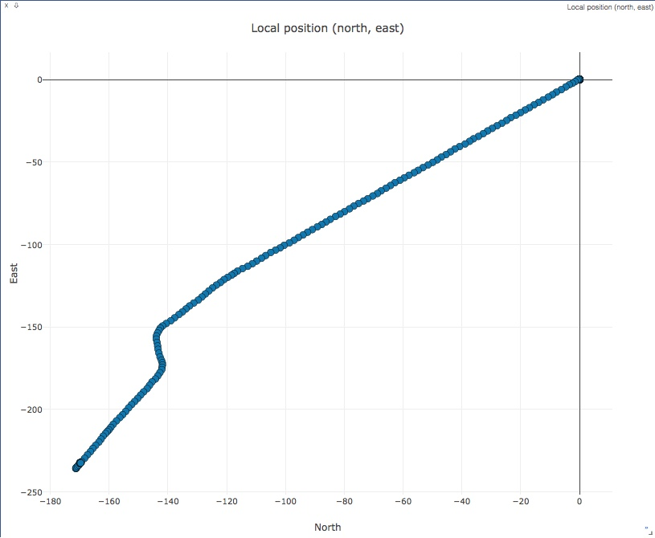
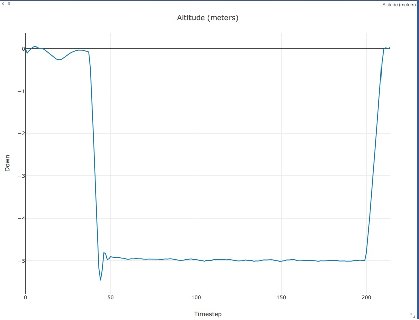
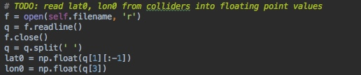
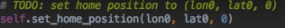
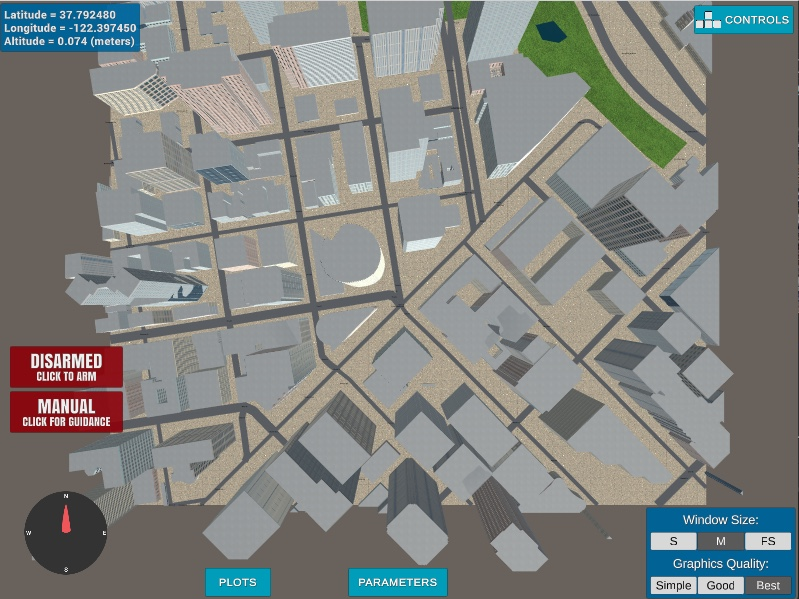
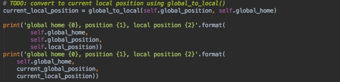
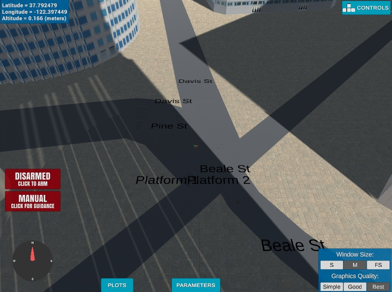
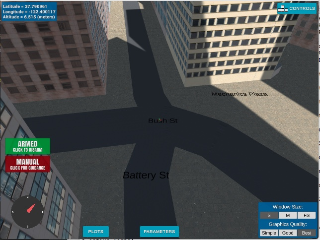
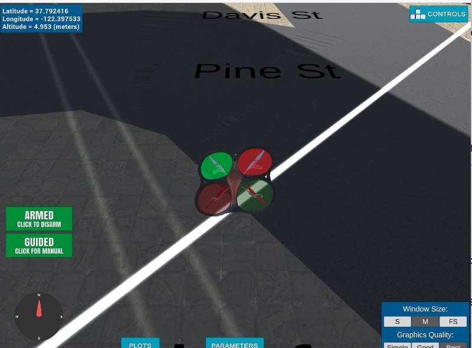
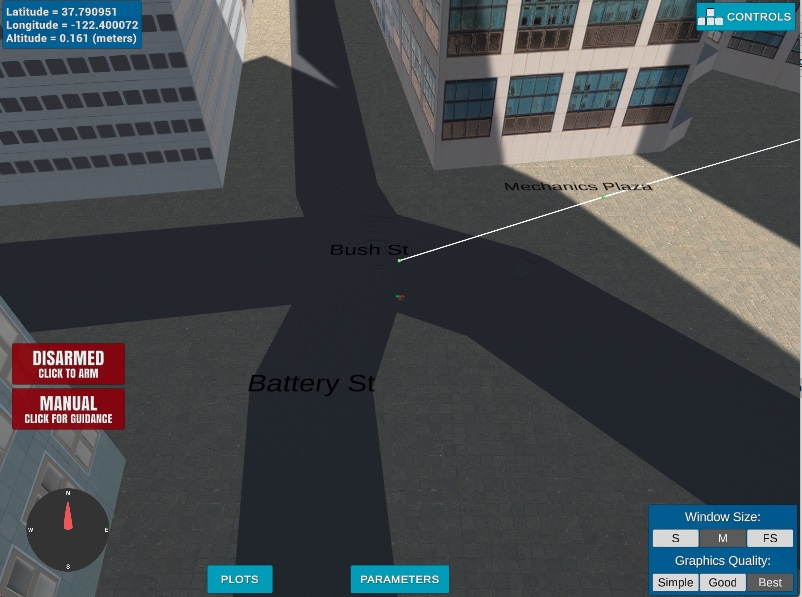

## Project: 3D Motion Planning


---

# Acknowledgements
#### I would like to thank a few people that actually took the time to help me understand python and finish this project after months of not being able to get help: @Ayshine, @Nouman (many thanks - your code helped me finish the last of the debugging), and @'Shubham Rana'

---

# ** Required before you run the code!! \*\*
### In another terminal run ```python -m visdom.server``` and open ```http://localhost:8097``` in browser.
It will create these two plots:
one of the position



and one of the altitude



--- 
# Required Steps for a Passing Submission:
1. Load the 2.5D map in the colliders.csv file describing the environment.
2. Discretize the environment into a grid or graph representation.
3. Define the start and goal locations.
4. Perform a search using A* or other search algorithm.
5. Use a collinearity test or ray tracing method (like Bresenham) to remove unnecessary waypoints.
6. Return waypoints in local ECEF coordinates (format for `self.all_waypoints` is [N, E, altitude, heading], where the drone’s start location corresponds to [0, 0, 0, 0].
7. Write it up.
8. Congratulations!  Your Done!

## [Rubric](https://review.udacity.com/#!/rubrics/1534/view) Points
### Here I will consider the rubric points individually and describe how I addressed each point in my implementation.  

---
### Writeup / README
### Explain the Starter Code and functionality of what's provided in `motion_planning.py` and `planning_utils.py`
The starter code uses many of the functions created in the Drone class attributes and a few newly defined functions. 
The newer functions are 1.) a rewritten state_callback() function that includes the step to plan a path, 2.) a new function
that uses msgpack to send waypoints from self.waypoints to file, and 3.) a plan_path() function that sets the state to PLANNING,
reads in information from the colliders.csv file for starting location and grid creation, and sends an unpruned path to
the waypoints for the drone to fly between. Some of the additional functionality is in the file planning_utils.py. This 
additional functionality includes creating a grid over the city and obstacles, and defining the A* algorithm. Comments
were added in the code to explain each function.


### Implementing Your Path Planning Algorithm

---
#### 1. Set your global home position
The first line of the csv file was read and the floating point values extracted using the code:



 and the code to set the home position is:
 

 

Here is a lovely picture of our downtown San Francisco environment from above that shows some of the buildings in 
the map our drone uses!


Here is the map the program uses!



---
#### 2. Set your current local position
The local position to the global home position is set and checked using 

 

and using the north and east offsets in the grid.

---
#### 3. Set grid start position from local position
The grid start was set using the following code:
```     
        drone_start_global =  (self._longitude, self._latitude, 0.0)
        self.set_home_position(drone_start_global[0], drone_start_global[1], drone_start_global[2])
        drone_start_local = (global_to_local(drone_start_global, self.global_home))
        drone_start_local = (int(drone_start_local[0]) - north_offset, int(drone_start_local[1]) - east_offset)
        grid_start = drone_start_local
 ```
 It's a little roundabout, but it works. 
 
  

---  
#### 4. Set grid goal position from geodetic coords
The grid goal was found by manual flight to another intersection.




and set using this code and center appropriately by subtracting off the offsets in the grid creation
```
        # Set goal as some arbitrary position on the grid
        Lat = 37.79096 # picked locatiion by flying around #
        Lon = -122.40012 # picked location by flying around #
        Alt = -self._altitude
        print("Alt: ", Alt, " , Lat: ", Lat, " , Lon: ", Lon)
        drone_end_global = (Lon, Lat, 0.)
        drone_end_local = global_to_local(drone_end_global, self.global_home)
        grid_goal = (-north_offset + int(drone_end_local[0]), -east_offset + int(drone_end_local[1]))
```
---
#### 5. Modify A* to include diagonal motion
 The A* algorithm was modified to include direct diagonal motion on the NE, NW, SE, SW directions and the 
 steps were weighted by 1/sqrt(2). Additional valid action requirements were also added in the planning_utils.py file.

---
#### 6. Cull waypoints 
The path was pruned using a function designed to use collinearity and tuned by adjusting 
the acceptable error. 

The final result took an unpruned path of with **234** waypoints to one with **six** waypoints shown below.
```bash
Pruned Path:  [(316, 445), (198, 327), (174, 295), 
                (174, 273), (156, 233), (146, 212)]
```


------
### Execute the flight
---
#### 1. Does it work?
It works!

The drone leaves the starting position below



and arrives at the final location!


---
### Double check that you've met specifications for each of the [rubric](https://review.udacity.com/#!/rubrics/1534/view) points.
 
IT DOES!!

 ---
# Extra Challenges: Real World Planning
This is a nice idea that may have been possible if I could have gotten help understanding the python errors three 
months ago.

"For an extra challenge, consider implementing some of the techniques described in the "Real World Planning" lesson. 
You could try implementing a vehicle model to take dynamic constraints into account, or implement a replanning method to invoke if you get off course or encounter unexpected obstacles."


